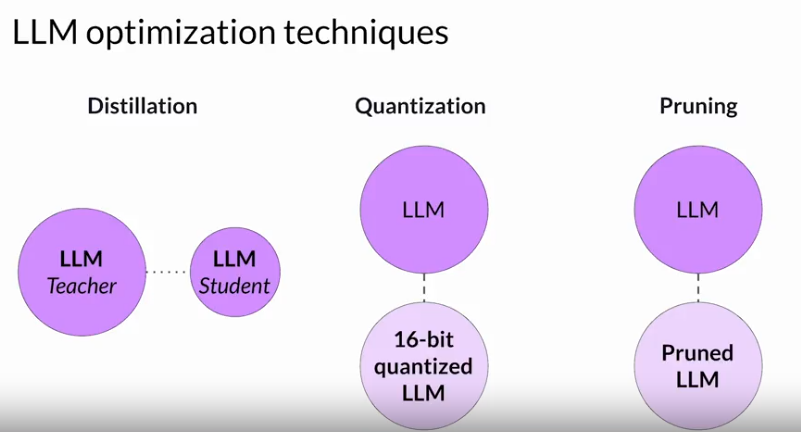
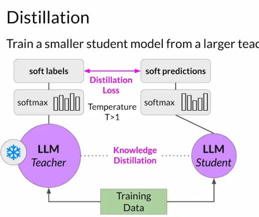
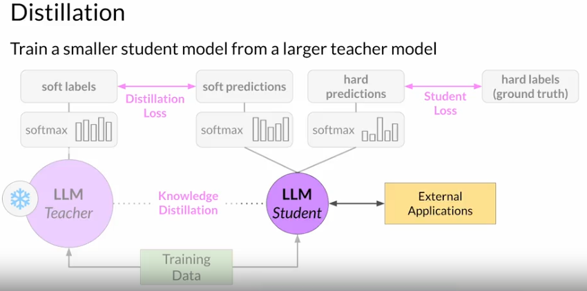
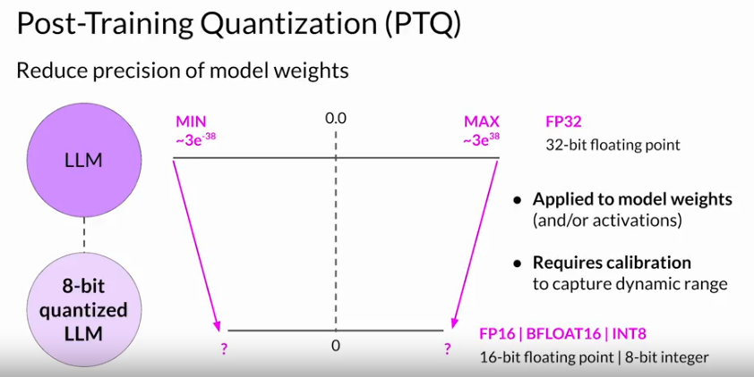

# Model Optimization for deployment

Few Ideas: 
1) reduce size of model with maintaining performance 
    - Distillation, Quantization, Pruining 
    

    **Distillation**
    The knowledge distillation between teacher and student model is achieved by minimizing a loss function called the distillation loss. To calculate this loss, distillation uses the probability distribution over tokens that is produced by the teacher model's softmax layer. 

    

     With a temperature parameter greater than one, the probability distribution becomes broader and less strongly peaked. This softer distribution provides you with a set of tokens that are similar to the ground truth tokens. In the context of Distillation, the teacher model's output is often referred to as soft labels and the student model's predictions as soft predictions.

     Distillation refers to the student model outputs as the hard predictions and hard labels. The loss between these two is the student loss.

     

     More effective for Encoder only models. 

     **Post Training Quantization**

     

     **Pruning**

     remove model weights with close to or equal to zero 

