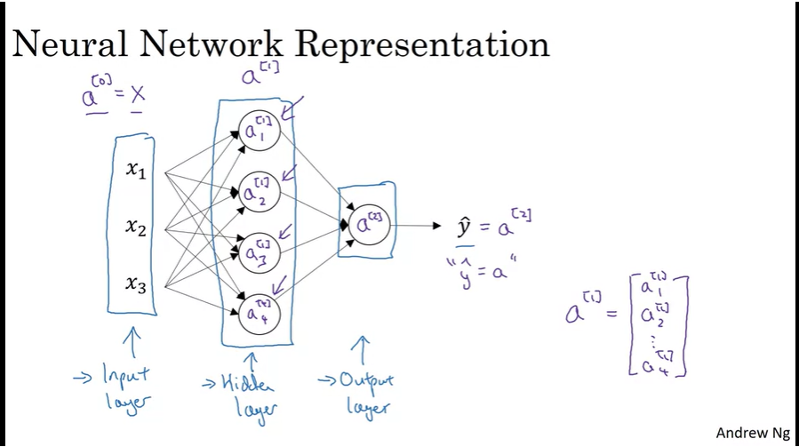
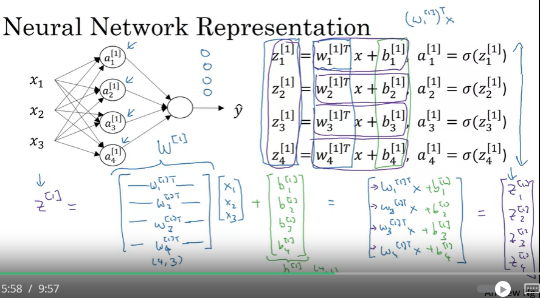
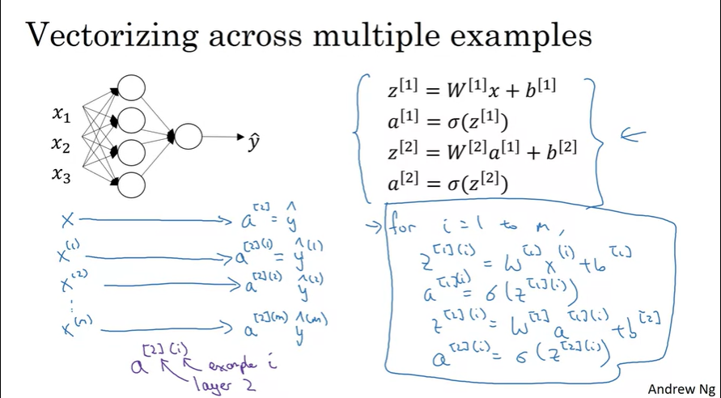

# Neural Networks 

## Layers 

- Input Layers, Hidden Layers, Output Layers
- Each Layer has multiple/single node 

Activations(a) = X passed onto the hidden layer by input layer

Hidden layer further generates activations which are passed to the output layer. 

Input layer is layer 0
Therefore this is a 2 layer NN 

The dimensions of parameter w will be (output units, input units)

## Vectorization of Logistic Regression Layers

## Vectorization across multiple examples 

 

## Activation Functions 

Sigmoid function was the most commonly used function 

example 2: g(Z) = tanh(Z) - superior to sigmoid fn 

activation fn can be different for different layers, for ex. for binary classification, sigmoid is used for output layer

Most commonly used: ReLU function 
**ReLU** = *rectified linear unit* 

a = max(0,Z);
Neural Networks learn faster if using ReLU fn as there is less effect of slope of the fn going to zero. ReLU: For positive inputs, the derivative of ReLU is 1, and for negative inputs, it's 0. This means the gradient does not vanish for positive inputs, allowing for more efficient backpropagation.

The sigmoid function has derivatives that can be very small when the input is far from zero (saturating at either end of the function). This causes the gradients to vanish, slowing down learning as updates become tiny.

ReLU: Facilitates better *gradient flow*. The gradient can pass through many layers without diminishing significantly (except when the unit is inactive). This helps in training deeper networks effectively.

**Leaky ReLU:** a = max(0.01*Z, Z)

