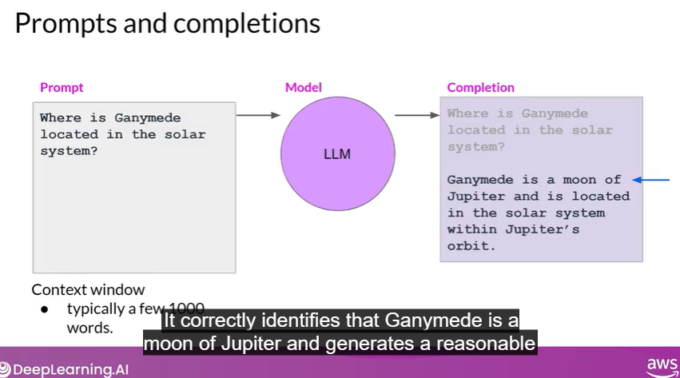
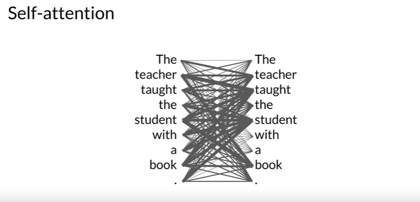
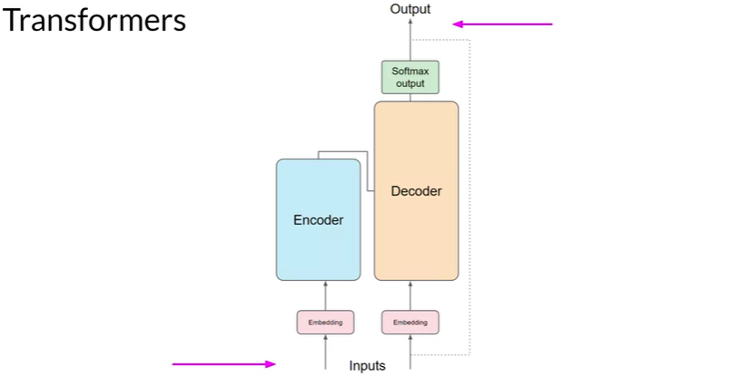

# Overview of LLMs

- mostly work on next word prediction 
- NER: Named entity recognition 

## RNN - Recurrent Neural Network 

To understand the context and predict the correct word, models need to understand the whole sentence or document. 

## Transformers Model 

Scale efficiently, Parallel Processing, Attention to input meaning 

### Attention Maps

The Transformers architecture is split into two different parts - the encoder and the decoder. These components work in conjunction with each other and also share a number of similarities. 

### Embedding layer

- each word/part of words are tokenized and converted to a vector , 512 size acc. to original paper. 

- Positional Embeddings (for word order) + Token embeddings

### Self Attn Layer

- Here, the model analyzes the relationships between the tokens in your input sequence. this allows the model to attend to different parts of the input sequence to better capture the contextual dependencies between the words. 

- The self-attention weights that are learned during training and stored in these layers reflect the importance of each word in that input sequence to all other words in the sequence. 

- But this does not happen just once, the transformer architecture actually has multi-headed self-attention. This means that multiple sets of self-attention weights or heads are learned in parallel independently of each other. The number of attention heads included in the attention layer varies from model to model - numbers rangeof 12-100 are common. 

- The intuition here is that each self-attention head will learn a different aspect of language. For example, one head may see the relationship between the people entities in our sentence. Whilst another head may focus on the activity of the sentence. Whilst yet another head may focus on some other properties such as if the words rhyme. The weights of each head are randomly initialized and given sufficient training data and time, each will learn different aspects of language.

### Feed Forward Network & Softax Output

- Now that all of the attention weights have been applied to your input data, the output is processed through a fully-connected feed-forward network. The output of this layer is a vector of logits proportional to the probability score for each and every token in the tokenizer dictionary. 

- You can then pass these logits to a final softmax layer, where they are normalized into a probability score for each word. This output includes a probability for every single word in the vocabulary, so there's likely to be thousands of scores here. One single token will have a score higher than the rest. This is the most likely predicted token. But as you'll see later in the course, there are a number of methods that you can use to vary the final selection from this vector of probabilities.

