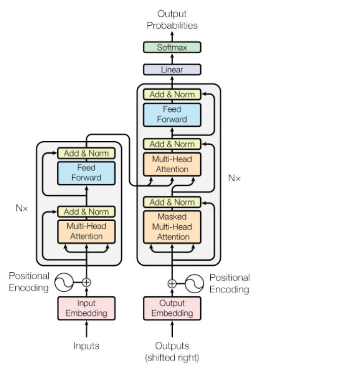

# Heading 

## Overiew of Transformer Architecture

**Encoder** : Encodes inputs ("prompts") with contextual understanding and produces one vector per input token

**Decoder** : Accepts input tokens and generates new tokens - in a loop till stop condition 

- Encoder Only Models 
- Encoder Decoder Models 
- Decoder Only Models (most common nowadays) ex. GPT, LLama, Bloom etc. 

## Self-Attention in the Encoder

The encoder in a transformer processes the input sequence and generates a context-aware representation of each element in the sequence.

### Steps of Self-Attention in the Encoder:
**Input Embeddings:** Assume we have a sentence, "The cat sat on the mat." Each word in the sentence is first converted into a vector (embedding) representing its meaning.

**Creating Query, Key, and Value Vectors:** For each word embedding, we create three vectors: Query (Q), Key (K), and Value (V) by multiplying the embedding by three different weight matrices (these are learned during training).

For simplicity, let's say our embeddings are 3-dimensional.

Example: For "The," the embedding might be [0.1, 0.2, 0.3]. We then create Q, K, and V vectors from this.

**Calculating Attention Scores:** For each word, we calculate attention scores with all other words in the sentence. This is done by taking the dot product of the Query vector of one word with the Key vectors of all words.

For instance, the Query of "The" will be dot-multiplied with Keys of "The," "cat," "sat," etc.

**Applying Softmax:** The attention scores are then normalized using the softmax function to ensure they add up to 1. This converts scores into probabilities.

**Weighted Sum of Values**: Each word's Value vectors are then weighted by these attention scores, and a weighted sum is taken. This produces a new representation for each word that incorporates information from the entire sentence.

For example, the new representation of "The" might include some weighted information from "cat," "sat," etc., based on their relevance.
Output: The output of the self-attention layer is a set of vectors (one for each word) that now contain context-aware information.

**Example of Self-Attention Calculation:**

Let's say we have an input sentence "He is reading a book." For simplicity, we'll use smaller vectors.

Embeddings:

"He": [0.1, 0.2, 0.3]
"is": [0.2, 0.1, 0.3]
"reading": [0.3, 0.1, 0.2]
"a": [0.2, 0.3, 0.1]
"book": [0.1, 0.3, 0.2]
Creating Q, K, V vectors (using learned weight matrices):

For "He":

Query: [0.2, 0.1, 0.3]
Key: [0.1, 0.2, 0.2]
Value: [0.2, 0.3, 0.1]
Repeat for other words...

Calculating Attention Scores:

Dot product of "He" Query with "He" Key, "is" Key, etc.
Example: 𝑄𝐻𝑒⋅𝐾𝐻𝑒=0.2∗0.1+0.1∗0.2+0.3∗0.2=0.02+0.02+0.06=0.10

Softmax and Weighted Sum:

Apply softmax to the scores to get weights.

Use these weights to get a weighted sum of the Value vectors.

## Attention in the Decoder
The decoder part of the transformer also uses attention mechanisms, but it has two types of attention: self-attention and encoder-decoder attention.

### Self-Attention in the Decoder:
Works similarly to the encoder but with a crucial difference - it ensures the model cannot look ahead in the sequence using a mask to prevent future tokens from influencing the current token.

### Encoder-Decoder Attention:
Here, the decoder attends to the encoder's output. This means for each word in the output sequence, the decoder considers all words in the input sequence (from the encoder).

### Steps in Encoder-Decoder Attention:
Decoder Self-Attention: Similar to the encoder's self-attention but with a mask to prevent peeking at future words.

### Encoder-Decoder Attention:

Query from Decoder: Use the decoder's self-attention output as Query.
Keys and Values from Encoder: Use the encoder's final output as Keys and Values.

Attention Mechanism: Compute attention scores between decoder Query and encoder Keys, apply softmax, and create weighted sums of encoder Values.

Example:

Imagine the encoder processed "He is reading a book" and the decoder is generating a French translation "Il lit un livre."

**Decoder at "Il":**
Uses its own self-attention to consider past context (e.g., no past context for the first word).
Uses encoder-decoder attention to focus on the relevant parts of "He is reading a book."

Query ("Il") with Keys from encoder ("He," "is," "reading," "a," "book").
Calculate attention scores, apply softmax, and compute weighted sum of Values from encoder.

- The Transformer architecture consists of an encoder and a decoder, each of which is composed of several layers. Each layer consists of two sub-layers: a multi-head self-attention mechanism and a feed-forward neural network. The multi-head self-attention mechanism allows the model to attend to different parts of the input sequence, while the feed-forward network applies a point-wise fully connected layer to each position separately and identically. 

- The Transformer model also uses residual connections and layer normalization to facilitate training and prevent overfitting. In addition, the authors introduce a positional encoding scheme that encodes the position of each token in the input sequence, enabling the model to capture the order of the sequence without the need for recurrent or convolutional operations.

# Generative Configuration - Inference Parameters 

- Max New Tokens: limit the tokens are generated 

- Greedy and Random Sampling: 
    - Top-k and Top-p sampling : limit the randomg sampling 
    - top-k: select and output from the top k results after applying random-weigthed strategy using the probabilities 
    - top-p : select an output using the randomg-weight strategy with the top ranked consecutive results by probability and with a cumulative probability <= p. 

- Temperature: shape of probability distribution for next tokens - more temp more randomness 

