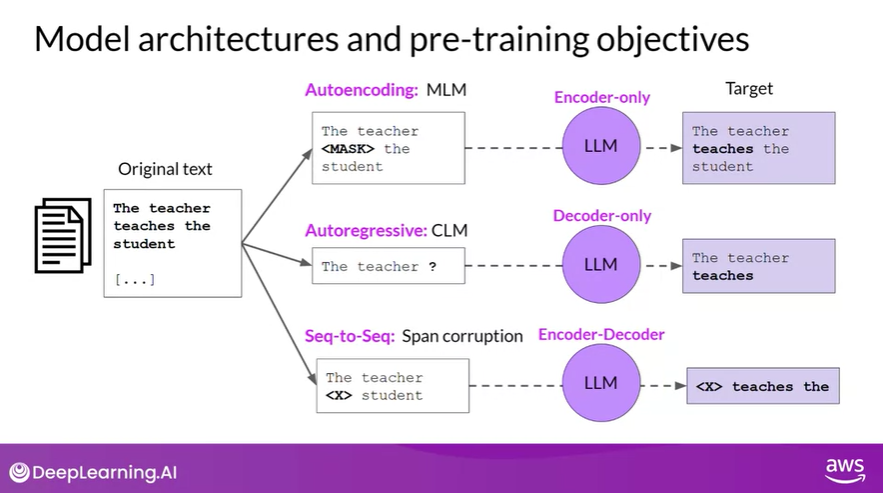
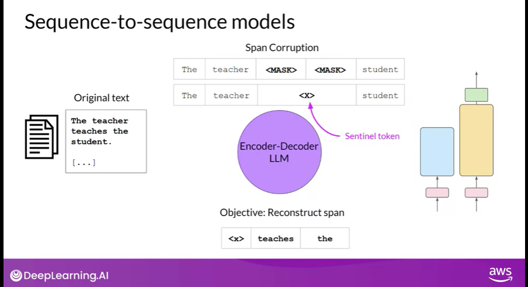
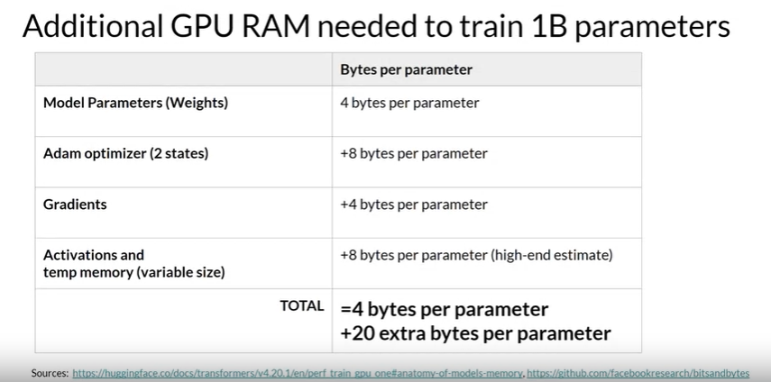
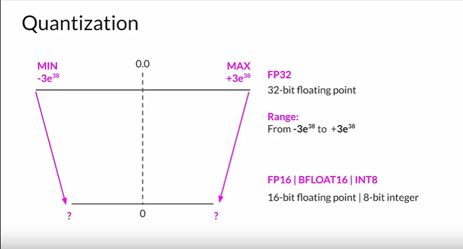
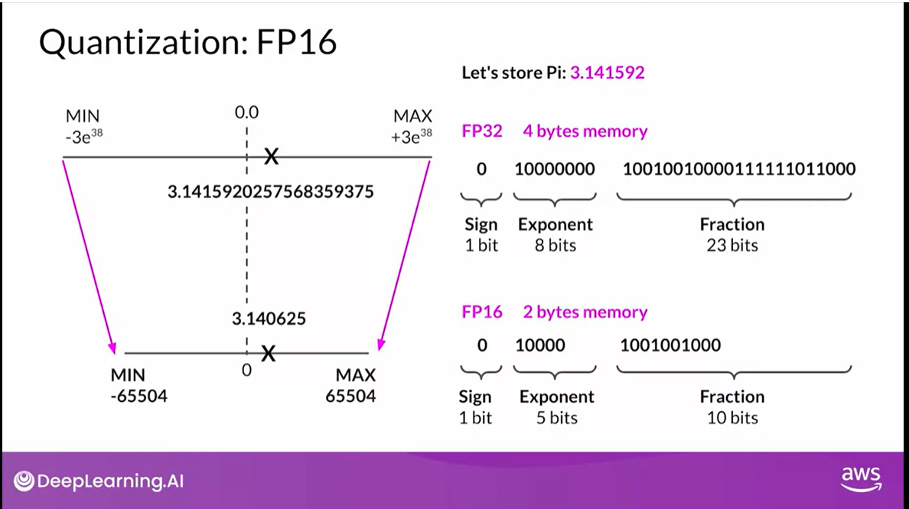
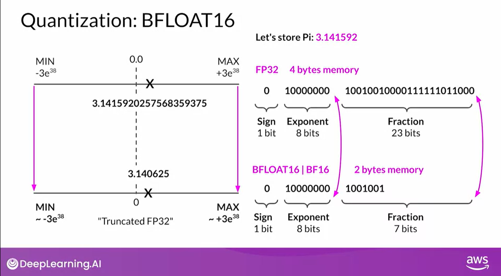
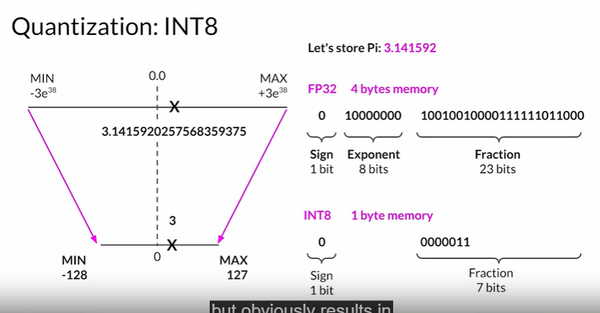
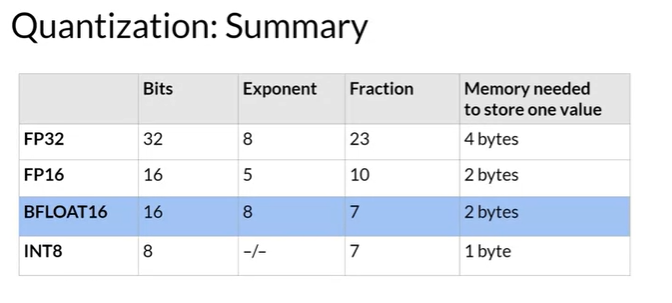

# Model Training 

## Pre Training 

- minimize loss 
- pre process data 

### Auto Encoding Models ( Encoding Only )

They are pre trained using *Masked Language Modeling (MLM)*
- Tokens are randomly masked and training objective is **denoising** : reconstruct the text by predicting masked token
- have bi directional context  

Good Use cases: 
- Sentiment Analysis 
- Named Entity Recognition 
- Word classification 

Ex. models - BERT, ROBERTA 

### Autoregressive Models (Decoder only)
- pretrained using *Causal Language Modeling (CLM)*
- objective is to predict next token 
- unidirectional context 

Good Use Cases: 
- Text generation 
- other emergent behaviours (depending on model size)

Ex. models - GPT, BLOOM 

### Seq-to-Seq Models (both encoder and decoder)

Good Use cases: 
- translation 
- text summarization 
- question answering 

ex. models - BART, T5

CHALLENGES: Training Large Models

CUDA - Compute Unified Device Architecture 

## Memory Requirements

Memory needed to train the model = 6 * Memory needed to store the model weights (32-bit precision)

Training: 

## Quantization 

## FP-16

## BF-16 (Truncated FP32) 

Provides training stability 

- speeds up calculations and saves memory 
- maintains the range of FP 32 but reduces memory footprint by half 
- downside is that it is not suitable for integer calculations

## INT 8 

- dramatic loss of precision 

