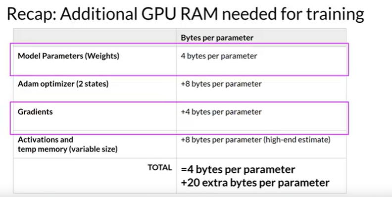
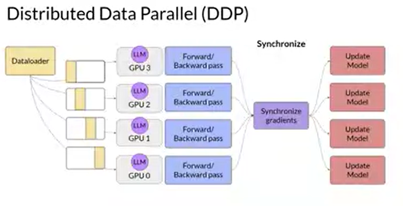
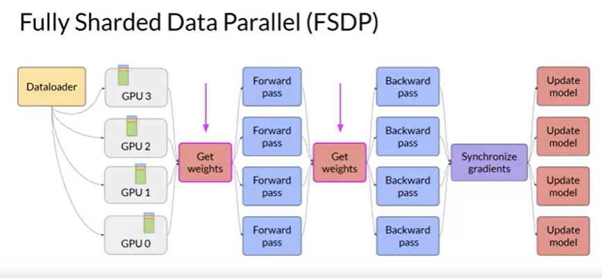
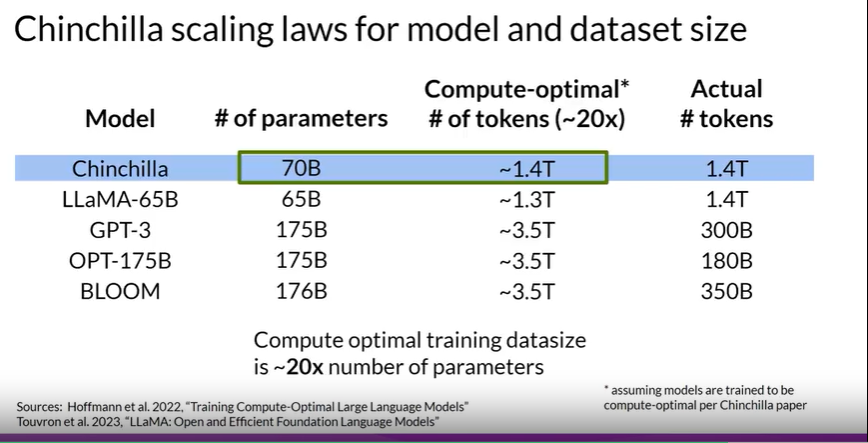

# Distributed Compute 

## Distributed Data Parallel (DDP) - PyTorch 

- in this the computation is parallel, but the whole model itself should fit on a single GPU. So each GPU has the model but processes a different part.

## Full Sharded Data Parallel (FSDP)

- ZeRO paper 
- model optimizer states or shards are distributed over GPUs 

- ZeRO Stage 1: only optimizer states 
- Zero Stage 2: optmizer states with gradients 
- Zero Stage 3: optimizer states, Gradients, parameters

- reduces overall GPU memory utilization 
- supports off loading to CPU If needed, slows the performance though as data combination required. 

# Scaling Laws 

PetaFlops per second Day a metric for compute budget 

## Data Adaptation Case Study 

BloombergGPT, developed by Bloomberg, is a large Decoder-only language model. It underwent pre-training using an extensive financial dataset comprising news articles, reports, and market data, to increase its understanding of finance and enabling it to generate finance-related natural language text. The datasets are shown in the image above.

During the training of BloombergGPT, the authors used the Chinchilla Scaling Laws to guide the number of parameters in the model and the volume of training data, measured in tokens. The recommendations of Chinchilla are represented by the lines Chinchilla-1, Chinchilla-2 and Chinchilla-3 in the image, and we can see that BloombergGPT is close to it. 

While the recommended configuration for the team’s available training compute budget was 50 billion parameters and 1.4 trillion tokens, acquiring 1.4 trillion tokens of training data in the finance domain proved challenging. Consequently, they constructed a dataset containing just 700 billion tokens, less than the compute-optimal value. Furthermore, due to early stopping, the training process terminated after processing 569 billion tokens.

The BloombergGPT project is a good illustration of pre-training a model for increased domain-specificity, and the challenges that may force trade-offs against compute-optimal model and training configurations.