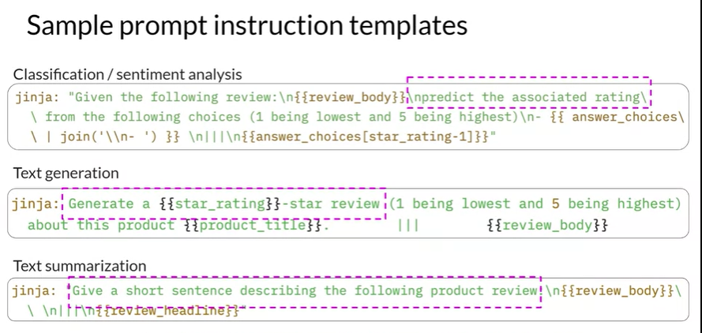
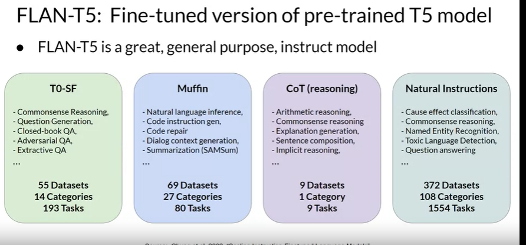
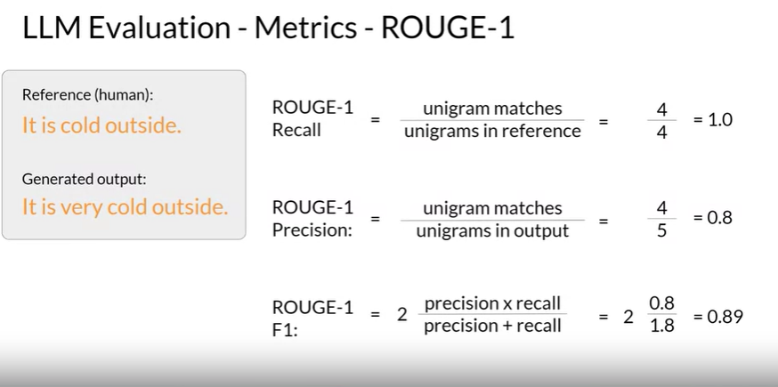
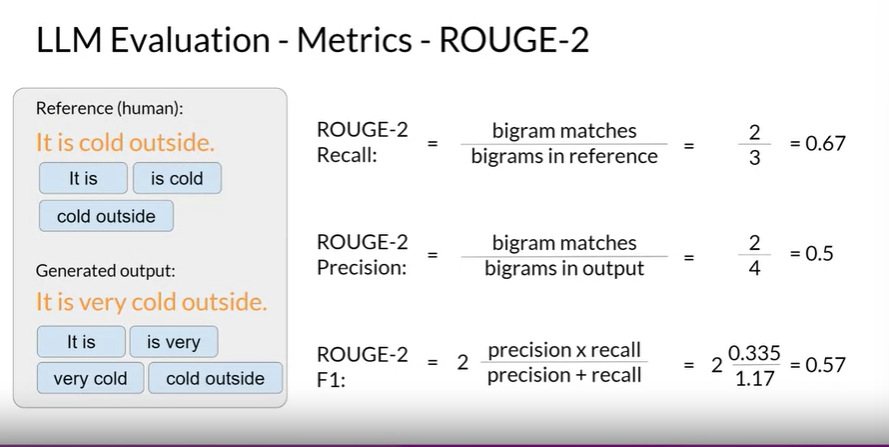
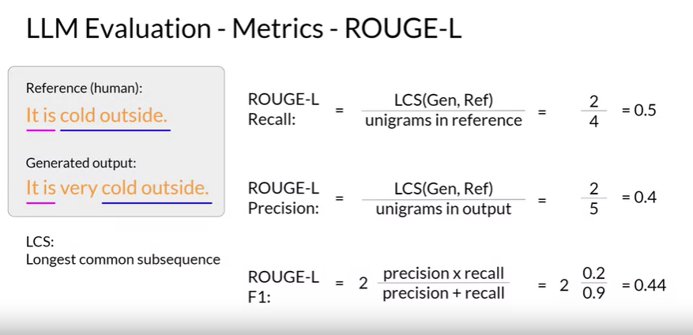
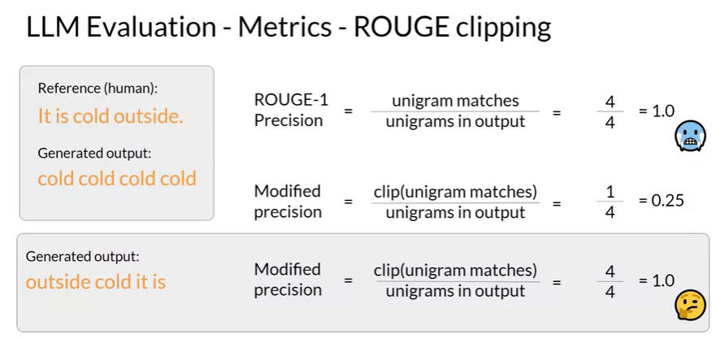
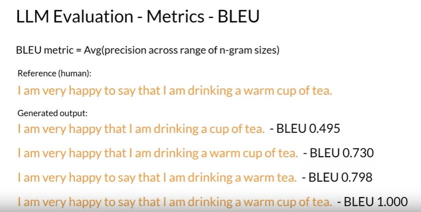

# LLM Fine Tuning at high level 

## Instruction Fine Tuning 

Instruction - Response pairs are used to train the model 
PROMPT[...], COMPLETION[...]

- All the model weights are updated : Full Fine tuning 
- Requires the memory to store complete model and memory optimization can be done 

Steps: 
1) Preparing the data 
    - Prompt instruction Templates 
    
    - Training, Validation and Test splits 
2) Fine tuning by using data 
3) Loss Calculation and Weights updation (backpropogation)

## Fine Tuning on Single Instruction 

ex. summarization or Named Entity Recognition 

### Catastrophic Forgetting

Fine tuning can significantly increase the performance of a model on a specific task but forget how to perform other task ability 

How to avoid Catastrophic Forgetting, if needed ? 
- Fine tune on **multiple tasks** at the same time
- consider **Parameter Efficient Fine Tuning (peft)**

### Multi Task Fine Tuning 

Variety of tasks taken and model trained on simultaneous tasks
But it requires a lot of data...

FLAN fine tuned models (Fine tuned lanaguage Net)
- set of instruction used to fine tune different models 
- last step of the training process 
- FLAN T5 is instruct version of T5 model 
- FLAN T5 is General purpose instruct models 

[This Paper](https://arxiv.org/abs/2210.11416) introduces FLAN (Fine-tuned LAnguage Net), an instruction finetuning method, and presents the results of its application. The study demonstrates that by fine-tuning the 540B PaLM model on 1836 tasks while incorporating Chain-of-Thought Reasoning data, FLAN achieves improvements in generalization, human usability, and zero-shot reasoning over the base model. The paper also provides detailed information on how each these aspects was evaluated.

ex. can be used to train the model on customer support chat data for bot. 

## Model Evaluation Metrics

For deterministic models, Accuracy = correct predictions/total predictions 

**ROUGE** : Recall Oriented Understudy for Gisting Evaluation evaluates the quality of machine generated summaries and translations in NLP. 
It compares output of a model to one or more human written referencetexts by calculating the overlap between them in terms of n-grams, which are sequences of words. For example, a 1-gram is a single word, and a 2-gram is a pair of words. ROUGE scores range from 0 to 1, with higher scores indicating greater similarity between the model output and the reference.

- used for text summarization 

**BLEU** : Bi lingual evaluation understudy is an algo designed to evaulate the wuality of machine learning translations by evaluating against human references. 

unigram - 1 word 
bigram - 2 words 

### Metrics ROUGE-1 

But rouge-1 doesnot consider order of words and context, for example not used instead of very won't change the score, but the mearning is changed. 

### Metrics Rouge-2

### Metrics Rouge-L

LCS - Longest common subsequence

ROUGE Clipping 

These are the issues with ROUGE metrics. 

### BLEU Score

Rouge for diagnostic evaluation of summarization tasks and bleu for translations tasks 

# Evaluation BenchMarks

- GLUE, SuperGLUE, MMLU (massive multitask language understanding), BIG bench hard, BIG bench and lite for math, common sense, bio, science...
- MMLU used nowadays for LLMs and general understanding
- HEML - Holistic Evaluation of Language models - considers multiple metrics like accuracy, calibrations, robustness, fairness, bias, toxicity, efficiency 

