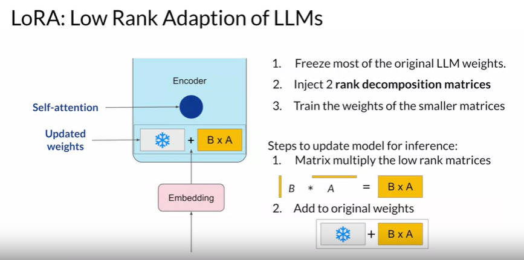
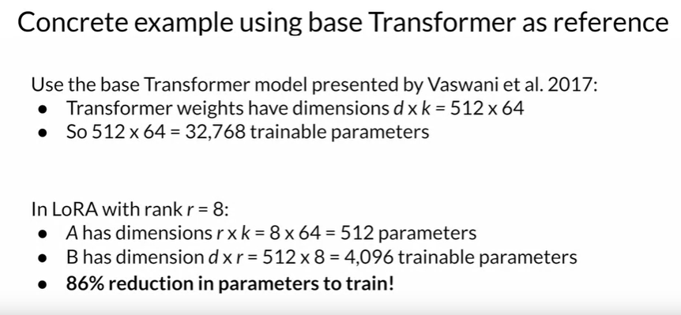
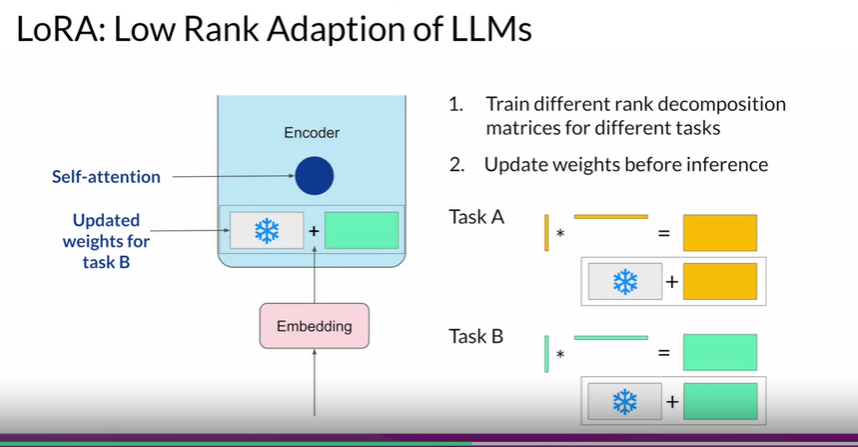

# Intro to PEFT or Parameter Efficient Fine tuning 

- LLM with most layers frozen, and small trainable layers
- Adding new trainable layers
- Trainable weights are much smaller! Can be done on single GPU as well 

PEFT is a solution for catastrophic forgetting as well. 

## PEFT Methods 

- Selective Methods - select subset of initial LLM parameters to fine tune
- Reparameterization - reparameterize model weights using a low rank representation (loRA)
- Additive - add trainable layers or parameters to model (Adapters, Soft Prompts- Prompt Tuning)

## LORA - Low Rank Adaptation of LLMs 

only a small trade performance loss - but effectiveness of higher rank appears to plateau 

--rank : the inner dimension of the low-rank matrices to train; a higher rank means more trainable parameters. --learning_rate : the default learning rate is 1e-4, but with LoRA, you can use a higher learning rate

Different ranks are better suited for different tasks:
Low ranks: Base model fine-tuning, longer responses, bullet points
Higher ranks: Teaching new concepts, teaching new associations, ceiling 

## Soft Prompts - Prompt Tuning 

Additional Trainable tokens are added to inputs (soft prompts)

The set of trainable tokens is called a soft prompt, and it gets prepended to embedding vectors that represent your input text. 

The soft prompt vectors have the same length as the embedding vectors of the language tokens. And including somewhere between 20 and 100 virtual tokens can be sufficient for good performance. 

The tokens that represent natural language are hard in the sense that they each correspond to a fixed location in the embedding vector space. However, the soft prompts are not fixed discrete words of natural language. 

Instead, you can think of them as virtual tokens that can take on any value within the continuous multidimensional embedding space. And through supervised learning, the model learns the values for these virtual tokens that maximize performance for a given task.