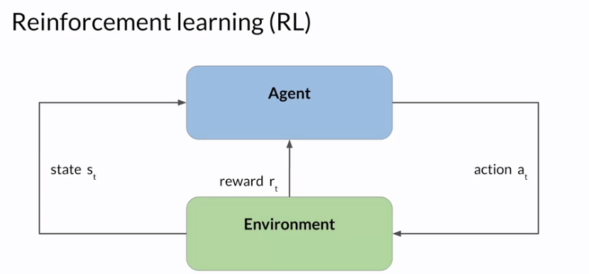
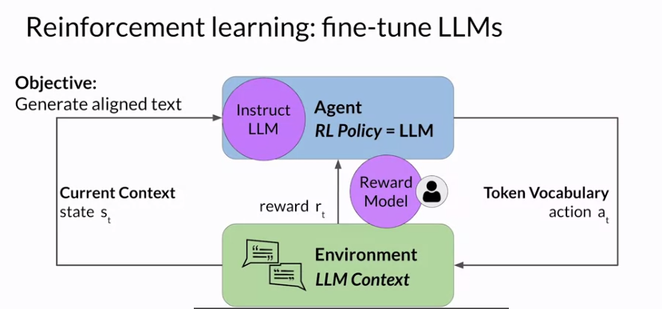
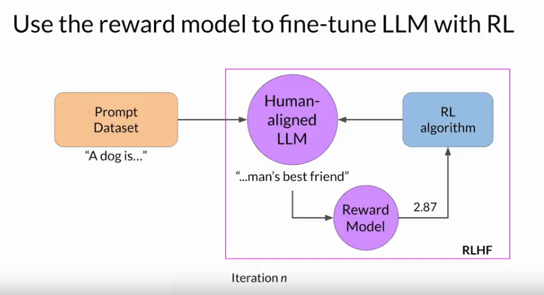
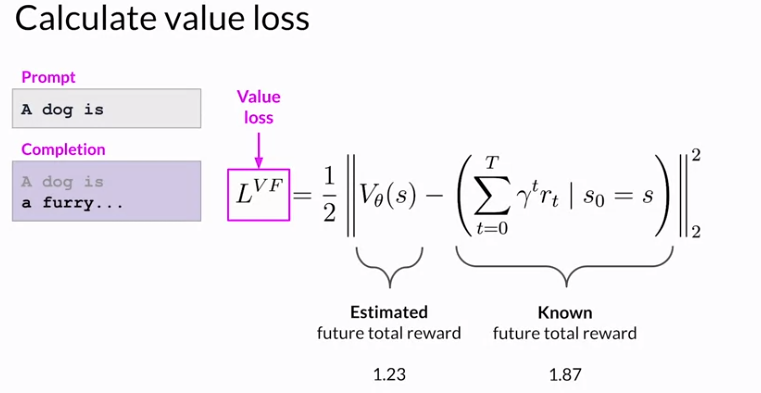
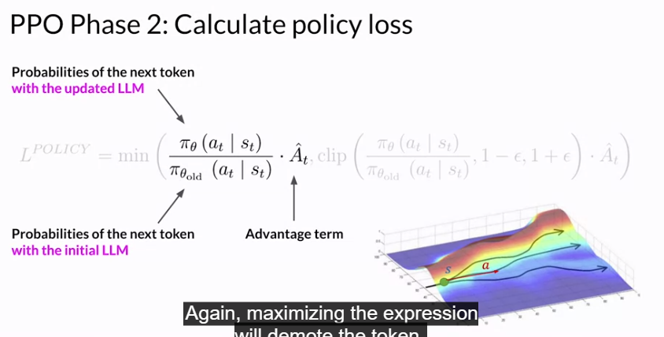
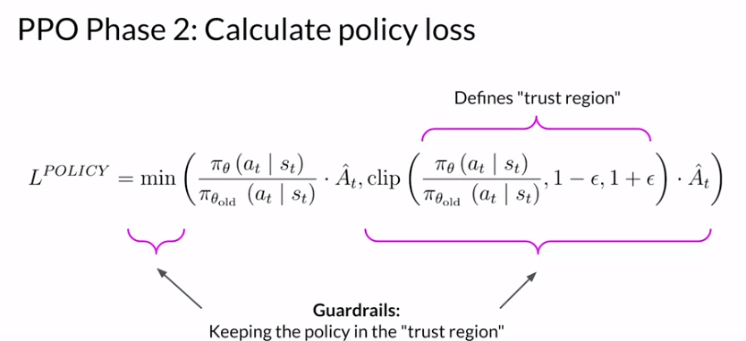
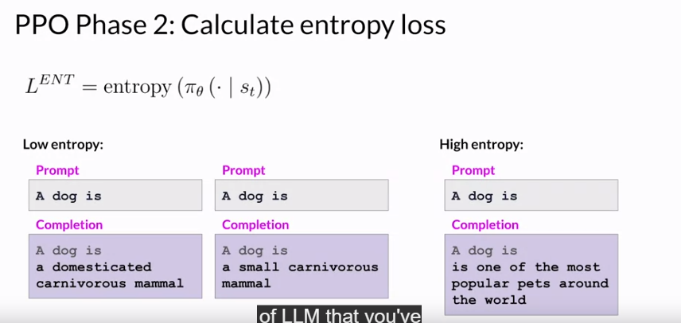
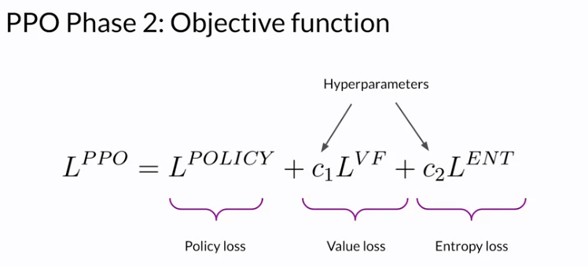
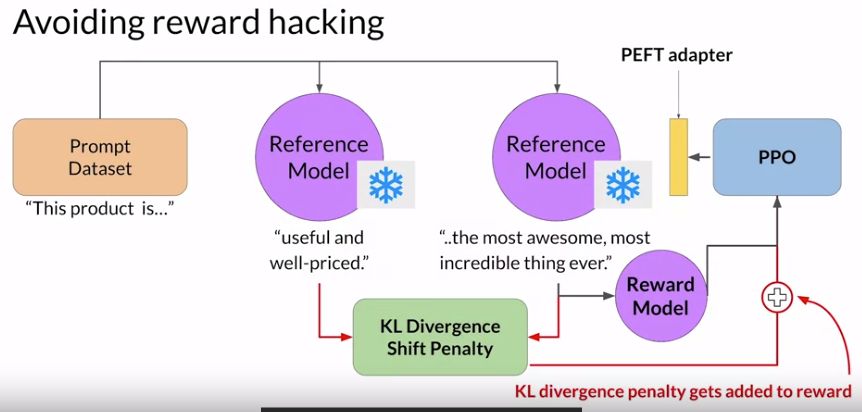
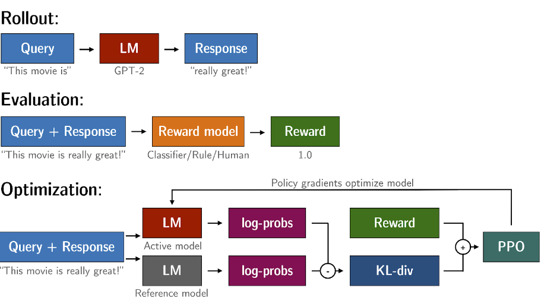

# RLHF Reinforcement learning using human feedback 

## Human aligned LLM 

- continous feedback processes 

### Reinforcement LEarning 

- agent works on RL Policy (model)
- the series of actions and corresponding states form a playout, often called a **rollout**. 
- extending to LLMS: 
    

    - in context of Language modeling, the sequence of actions and states in called a rollout, instead of the term playout that's used in classic reinforcement. 
    - The reward model is the central componenet of the reinforcement learning process, it encodes all of the preferences that have been learned from a human feedback, and it plays a central role in how the model updates its weights over many iterations. 

The reward model is trained on dataset of human feedback on hate and no hate. 

### Using the reward model 

**RL ALGORITHMS** , ex: PPO (Proximal Policy Optimization)

*Proximal Policy Optimization Algorithm* 
proximal - updates are small and rewards maximized

The losses and rewards in Phase 1 are used in Phase 2 to update the weights of LLM. Phase 1 weight of model are frozen.

- Value Function: estimates the expected total reward for a given state S. In other words, as the LLM generates each token of a completion, you want to estimate the total future reward based on the current sequence of tokens. a basline to evaluate the quslity of completions against your alignment criteria. 

- updates to phase 2 are done on the bases of value loss and rewards. the updates are kept within a small(proximal) region called 'trust region'. 

**PPO Phase-2**: calculate Policy Loss
// what happening? 

Calculating entropy loss: 

Objective Function: 

Multiple iterations occured for phase1,2

### Reward Hacking 

instruct model is used as reference model with frozen weights and the output of Reference model and RL updated LLM are compared using **KL Divergence Shift Penalty.**

KL divergence is a statistical measure of how different two probability distributions are. You can use it to compare the completions off the two models and determine how much the updated model has diverged from the reference. 

## KL Divergence 

KL-Divergence, or Kullback-Leibler Divergence, is a concept often encountered in the field of reinforcement learning, particularly when using the Proximal Policy Optimization (PPO) algorithm. It is a mathematical measure of the difference between two probability distributions, which helps us understand how one distribution differs from another. In the context of PPO, KL-Divergence plays a crucial role in guiding the optimization process to ensure that the updated policy does not deviate too much from the original policy.

## Scaling Human Feedback 

Ideas: 
- consitutional AI

# Resources 

[Link 1 - RLHF](https://huggingface.co/blog/trl-peft)